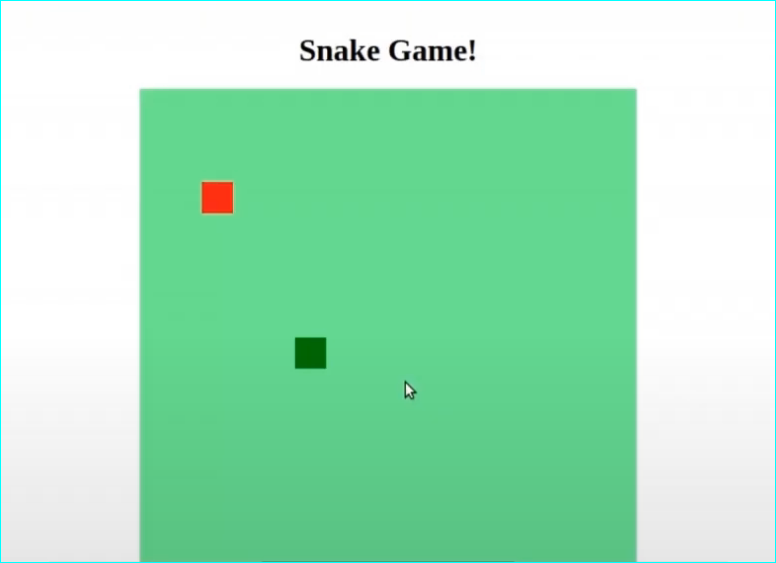
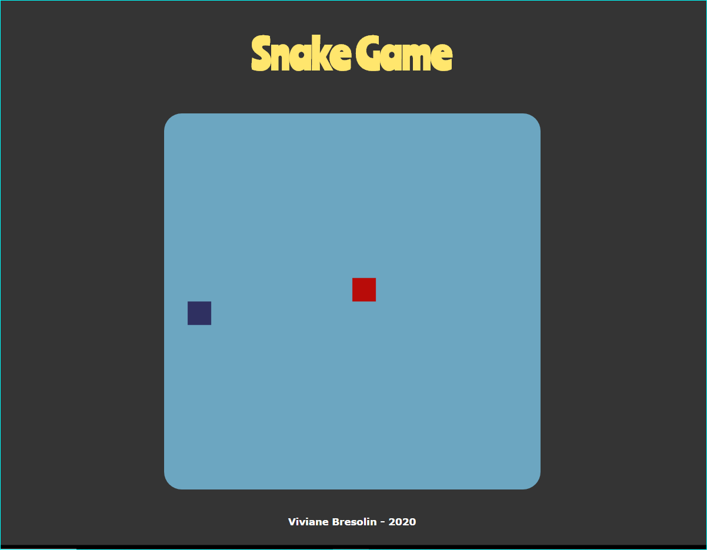

## Snake Game with HTML, CSS, and Javascript
Project from the bootcamp "HTML Web Developer" offered by Digital Innovation One (https://digitalinnovation.one/).

### Project Description:
 The goal of this project was to develop in a simple way the classic Snake Game with HTML, CSS, and JavaScript.

### Game developed with the instructor's directions during the class:

### Game customized by me:
- I've changed the font-family and I've chosen a font from Google Fonts called Ranchers.
- The color scheme was generated in the website https://coolors.co/.

